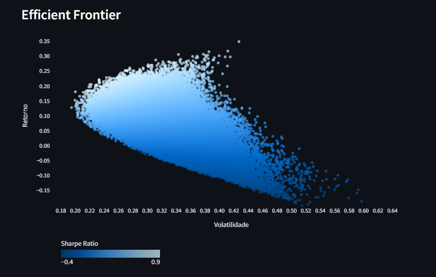

# Fronteira Eficiente de Markowitz

Este repositório contém uma aplicação para calcular a **Fronteira Eficiente de Markowitz**, utilizando a abordagem clássica de otimização de portfólio baseada na teoria moderna de portfólios de Harry Markowitz. A aplicação está disponível para uso diretamente no navegador através da plataforma **Streamlit**: [Acessar Aplicação](https://markowitz-frontier.streamlit.app/).

## Funcionalidades

- Cálculo da **Fronteira Eficiente** com base em uma lista de ativos fornecidos pelo usuário.
- Gera gráficos interativos da Fronteira Eficiente.
- Otimização de portfólios para risco mínimo ou máximo retorno ajustado ao risco.

## Demonstração

Acesse a aplicação diretamente no seu navegador:
👉 [Markowitz Frontier App](https://markowitz-frontier.streamlit.app/)



## Instalação Local

Se preferir rodar a aplicação localmente, siga os passos abaixo:

### Pré-requisitos

- Python 3.8 ou superior
- Bibliotecas necessárias listadas no arquivo `requirements.txt`

### Passos para Rodar Localmente

1. Clone o repositório:

   ```bash
   git clone https://github.com/seu-usuario/markowitz-frontier.git
   ```

2. Acesse o diretório do projeto:

   ```bash
   cd markowitz-frontier
   ```

3. Instale as dependências:

   ```bash
   pip install -r requirements.txt
   ```

4. Execute a aplicação:

   ```bash
   streamlit run app.py
   ```

## Uso

1. Insira os ativos;
2. Selecione o período desejado ou o range de datas;
3. Defina um número de carteiras geradas aleatóriamente;
4. Use as métricas de risco e retorno para tomar decisões de alocação de ativos.

## Teoria Moderna de Portfólios (Markowitz)

A Teoria Moderna de Portfólios, introduzida por Harry Markowitz em 1952, é uma abordagem matemática para selecionar uma carteira de investimentos de forma a maximizar o retorno esperado para um dado nível de risco. A Fronteira Eficiente é o conjunto de portfólios que oferecem o maior retorno esperado para cada nível de risco.

## Tecnologias Utilizadas

- **Python**: Linguagem principal para cálculo e manipulação dos dados.
- **Streamlit**: Para criar a interface de usuário interativa.
- **Numpy / Pandas**: Manipulação de dados.
- **Matplotlib / Plotly**: Geração de gráficos interativos.
